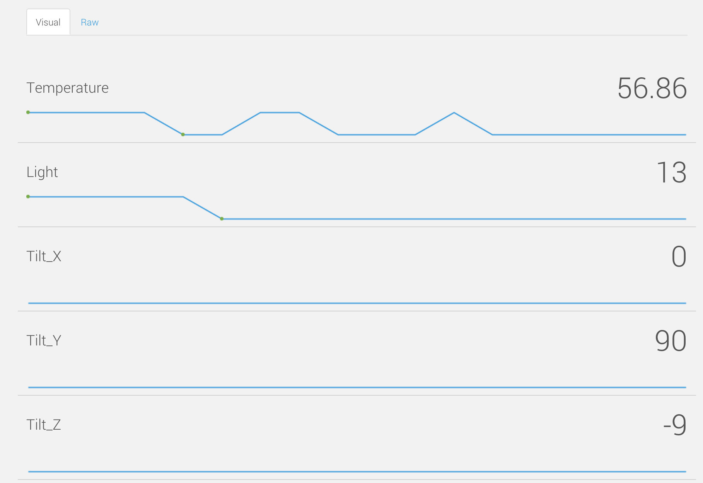

# IoT Datastore

| サービス名 | URL |
| -- | -- |
|Xively|[https://xively.com/](https://xively.com/)
|M2X|[https://m2x.att.com/](https://m2x.att.com/)|
|dweet.io|[https://dweet.io](https://dweet.io)|
|Amazon Kinesis|[http://aws.amazon.com/jp/kinesis/](http://aws.amazon.com/jp/kinesis/)|
|2lementry|[http://2lemetry.com/iot-platform/](http://2lemetry.com/iot-platform/)|
|senseIot|[http://www.sense-iot.com/](http://www.sense-iot.com/)|
|TempoIQ|[https://app.tempoiq.com](https://app.tempoiq.com)|
|zatar|[http://www.zatar.com/developer-zone](http://www.zatar.com/developer-zone)|
|data.sparkfun.com|[https://data.sparkfun.com/streams/](https://data.sparkfun.com/streams/)|

## Graphイメージ
### xively

### M2x

### dweet.io

### Sparkfun

## 参考になるリンク
* [http://www.netlabtoolkit.org/overview/](http://www.netlabtoolkit.org/overview/)

